# TelecomX-Analysis: Análisis de Evasión de Clientes

## Propósito del análisis
Este proyecto analiza los datos de clientes de Telecom X para identificar factores que contribuyen a la evasión (churn). A través de un Análisis Exploratorio de Datos (EDA), se buscan patrones para desarrollar modelos predictivos y estrategias de retención.

## Estructura del proyecto
- **data/**: 
  - `TelecomX_Data.json`: Datos originales.
  - `TelecomX_Data_clean.csv`: Dataset limpio tras desanidar JSON.
  - `TelecomX_Data_corrected.csv`: Dataset corregido.
  - `TelecomX_Data_final.csv`: Dataset sin nulos.
  - `TelecomX_Data_with_daily.csv`: Dataset con `Cargos_Diarios`.
  - `TelecomX_Data_standardized.csv`: Dataset estandarizado.
- **notebooks/**: 
  - `01_carga_datos.ipynb`: Carga de datos.
  - `02_exploracion_datos.ipynb`: Exploración inicial.
  - `03_limpieza_datos.ipynb`: Limpieza y desanidado.
  - `04_correccion_datos.ipynb`: Corrección de `Churn`.
  - `05_manejo_nulos.ipynb`: Imputación de nulos.
  - `06_creacion_cuentas_diarias.ipynb`: Creación de `Cargos_Diarios`.
  - `07_estandarizacion_datos.ipynb`: Estandarización de variables.
  - `08_analisis_evasion.ipynb`: Distribución de `Evasión`.
  - `09_analisis_evasion_categoricas.ipynb`: Evasión por variables categóricas.
  - `10_analisis_evasion_numericas.ipynb`: Evasión por variables numéricas.
  - `11_analisis_correlaciones.ipynb`: Análisis de correlaciones.
- **img/**:
  - `churn_count.png`: Conteo de `Evasión`.
  - `churn_pie.png`: Proporción de `Evasión`.
  - `evasion_por_contrato.png`: Evasión por tipo de contrato.
  - `evasion_por_genero.png`: Evasión por género.
  - `evasion_por_metodo_pago.png`: Evasión por método de pago.
  - `evasion_por_servicio_internet.png`: Evasión por servicio de internet.
  - `evasion_por_facturacion.png`: Evasión por facturación sin papel.
  - `evasion_antiguedad_hist.png`: Histograma de antigüedad por evasión.
  - `evasion_antiguedad_box.png`: Boxplot de antigüedad por evasión.
  - `evasion_cargos_mensuales_hist.png`: Histograma de cargos mensuales por evasión.
  - `evasion_cargos_mensuales_box.png`: Boxplot de cargos mensuales por evasión.
  - `evasion_cargos_totales_hist.png`: Histograma de cargos totales por evasión.
  - `evasion_cargos_totales_box.png`: Boxplot de cargos totales por evasión.
  - `evasion_cargos_diarios_hist.png`: Histograma de cargos diarios por evasión.
  - `evasion_cargos_diarios_box.png`: Boxplot de cargos diarios por evasión.
  - `correlacion_heatmap.png`: Matriz de correlación de variables.
  - `dispersion_cargos_diarios.png`: Dispersión de cargos diarios vs. evasión.
  - `dispersion_total_servicios.png`: Dispersión de total de servicios vs. evasión.
- **scripts/**: Scripts reutilizables (pendiente).
- **visualizations/**: Visualizaciones interactivas (pendiente).
- **README.md**: Descripción del proyecto.
- **requirements.txt**: Dependencias.

## Instrucciones para ejecutar
1. Clona el repositorio: `git clone https://github.com/<tu-usuario>/TelecomX-Analysis.git`
2. Instala las dependencias: `pip install -r requirements.txt`
3. Abre Google Colab y carga los notebooks desde `notebooks/`.
4. Usa `TelecomX_Data.json` o `TelecomX_Data_standardized.csv` desde `data/` o la URL directa.
5. Ejecuta las celdas en orden.

## Gráficos e insights
- **Exploración inicial**: 6 columnas, incluyendo `Churn` con valores vacíos.
- **Limpieza**: 21 variables tras desanidar JSON, sin duplicados.
- **Corrección**: 224 valores vacíos en `Churn` corregidos.
- **Nulos**: 11 nulos en `Cargos_Totales` imputados.
- **Variables**: `Cargos_Diarios` creado (`Cargos_Mensuales` / 30).
- **Estandarización**: Variables binarias a 1/0, nombres en español.
- **Análisis de Evasión**:
  - Distribución general:
    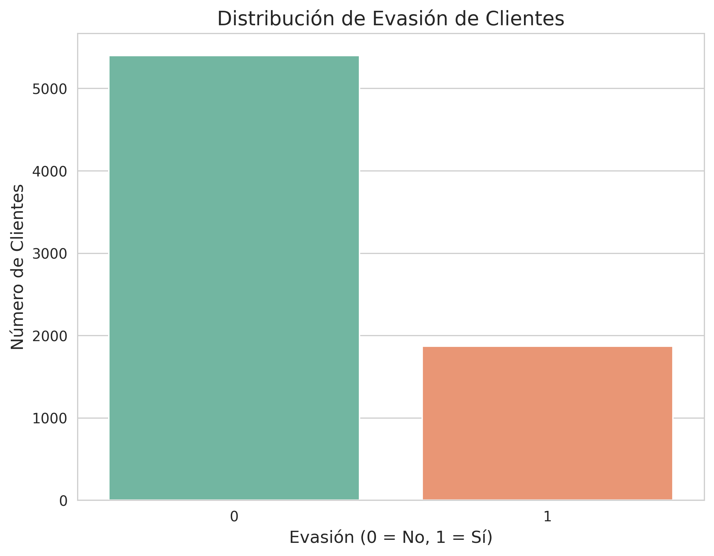
    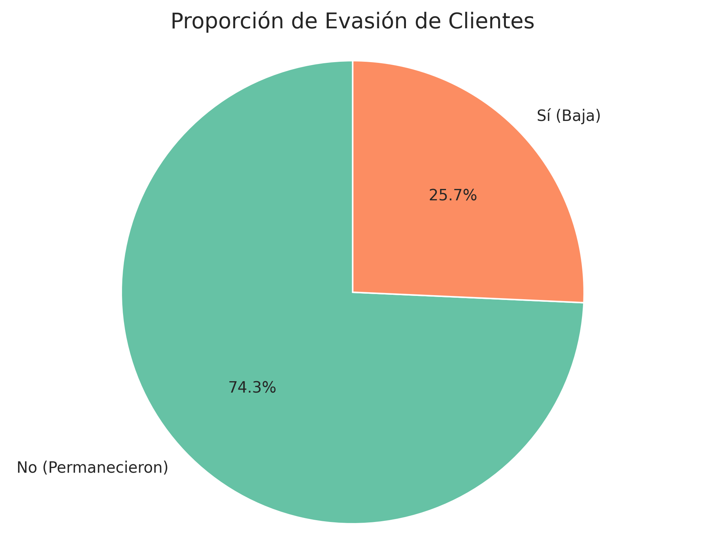
  - Evasión por categóricas:
    - **Contrato**:
      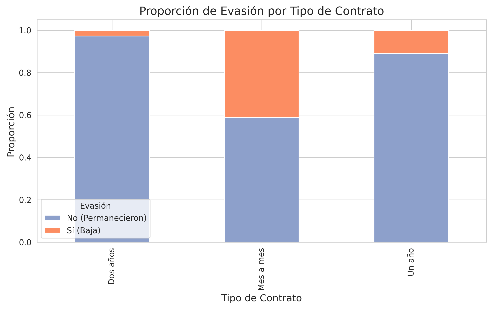
    - **Género**:
      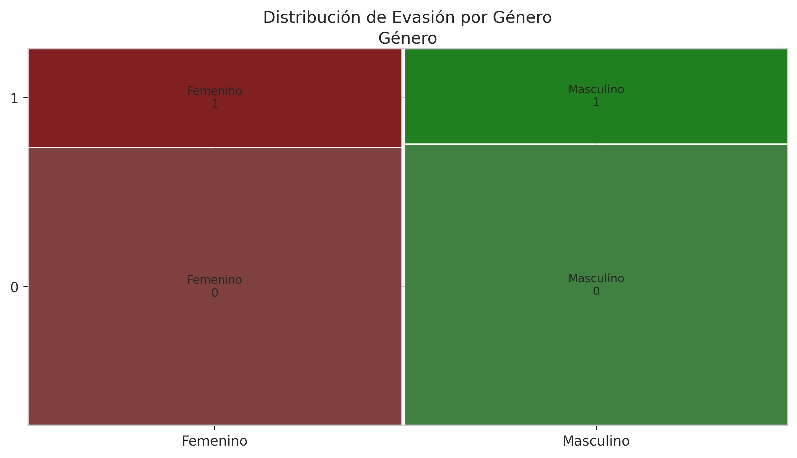
    - **Método de Pago**:
      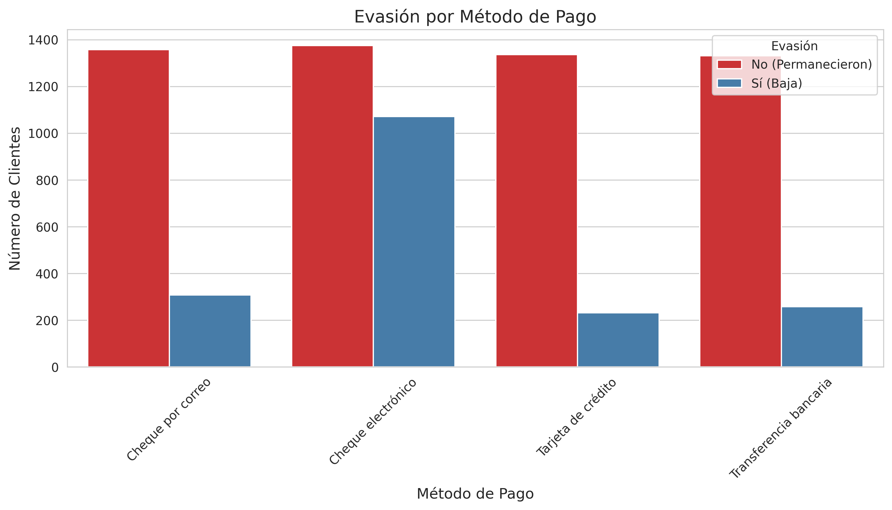
    - **Servicio de Internet**:
      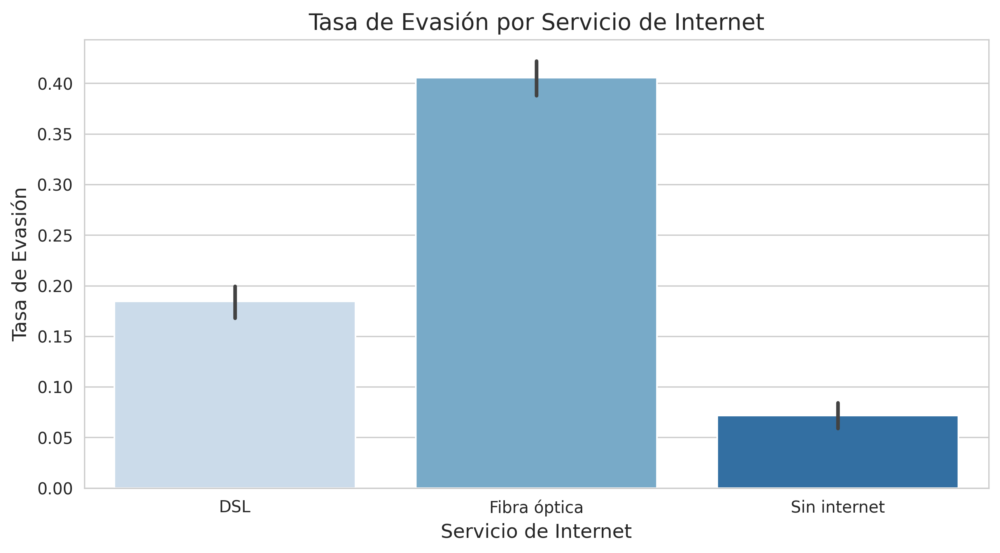
    - **Facturación Sin Papel**:
      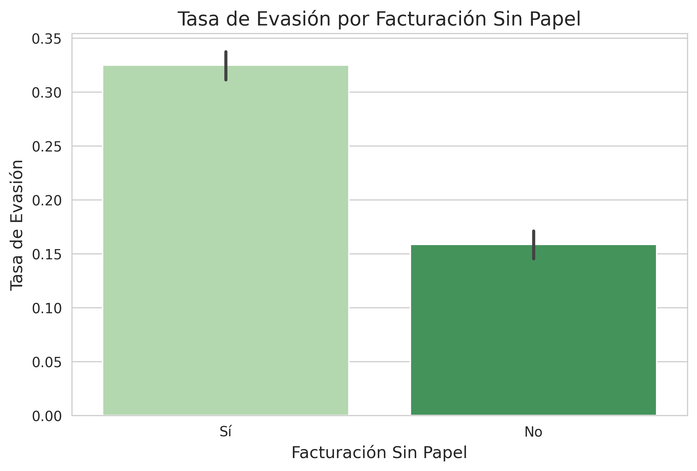
  - Evasión por numéricas:
    - **Antigüedad**:
      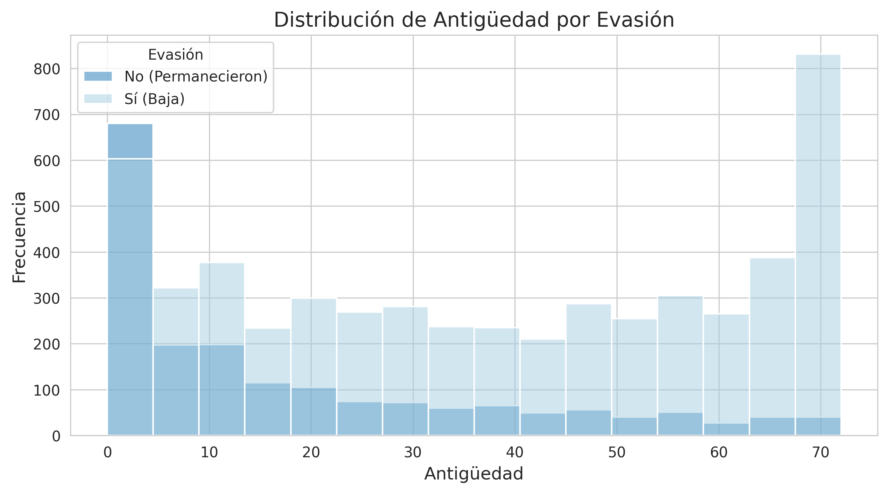
      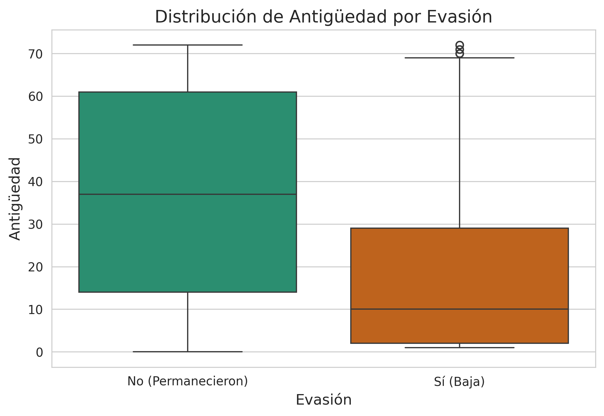
    - **Cargos Mensuales**:
      
      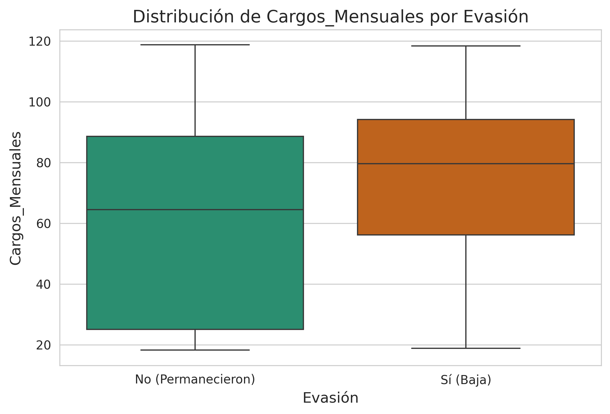
    - **Cargos Totales**:
      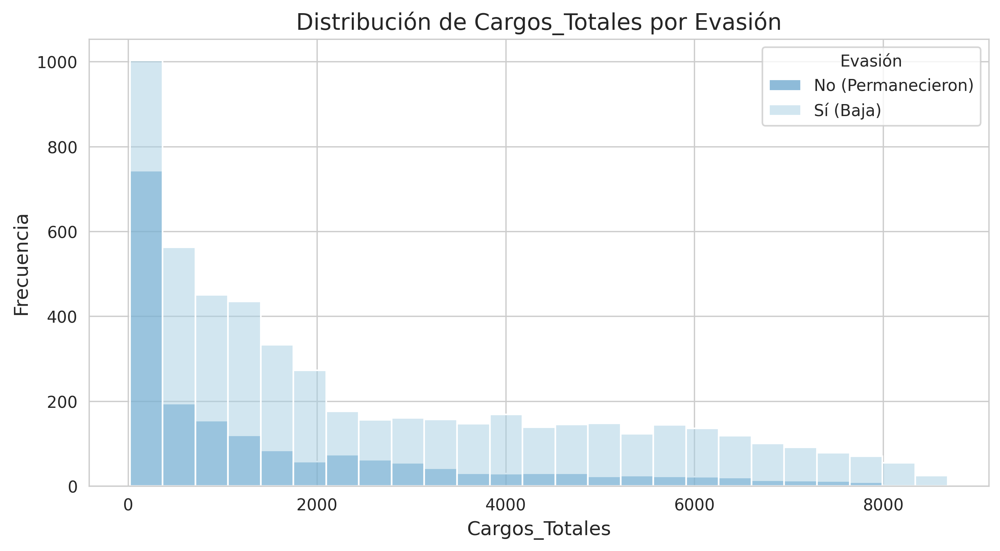
      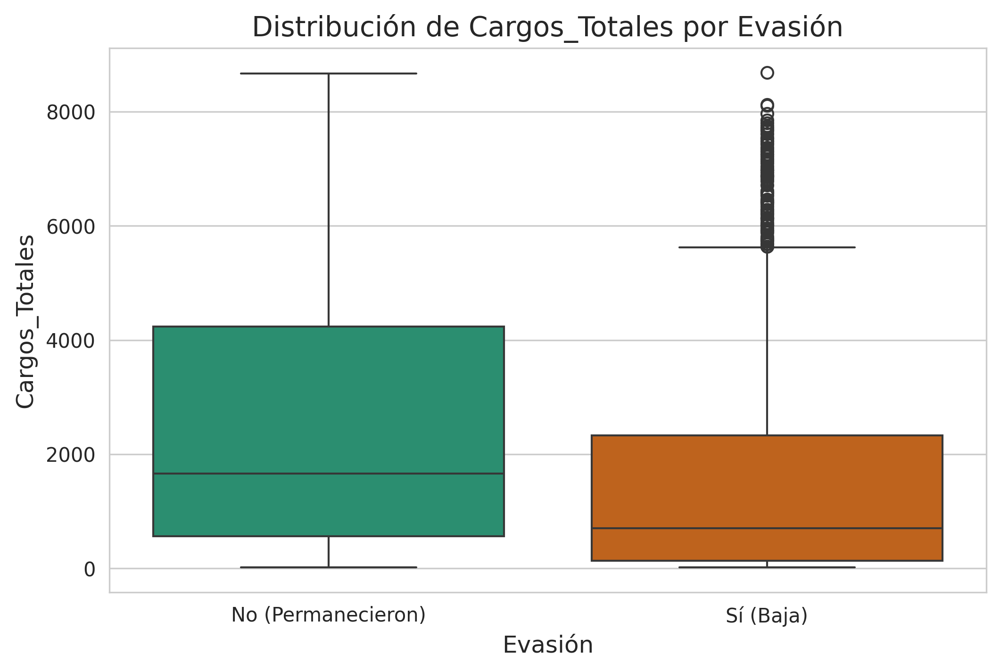
    - **Cargos Diarios**:
      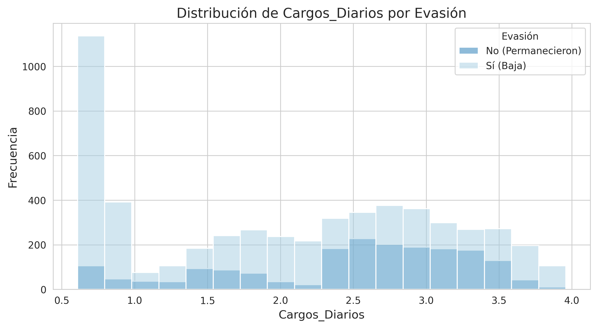
      
  - Correlaciones:
    - **Matriz de Correlación**:
      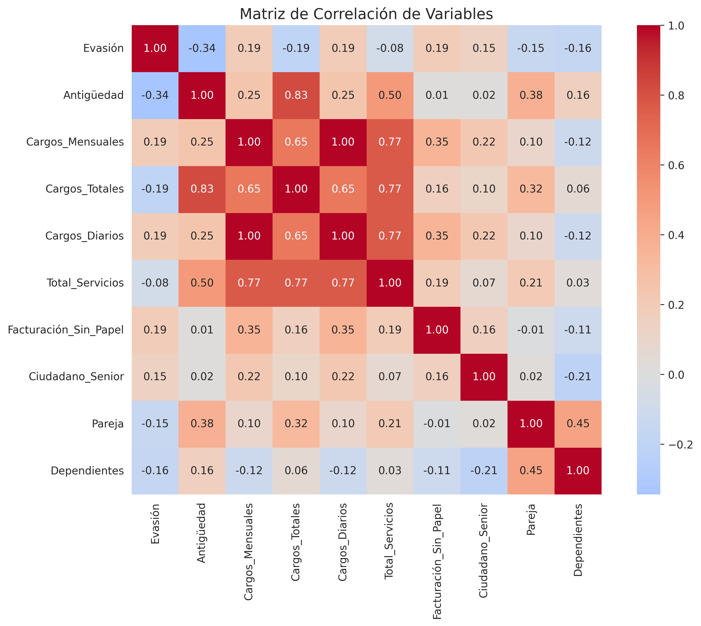
    - **Cargos Diarios**:
      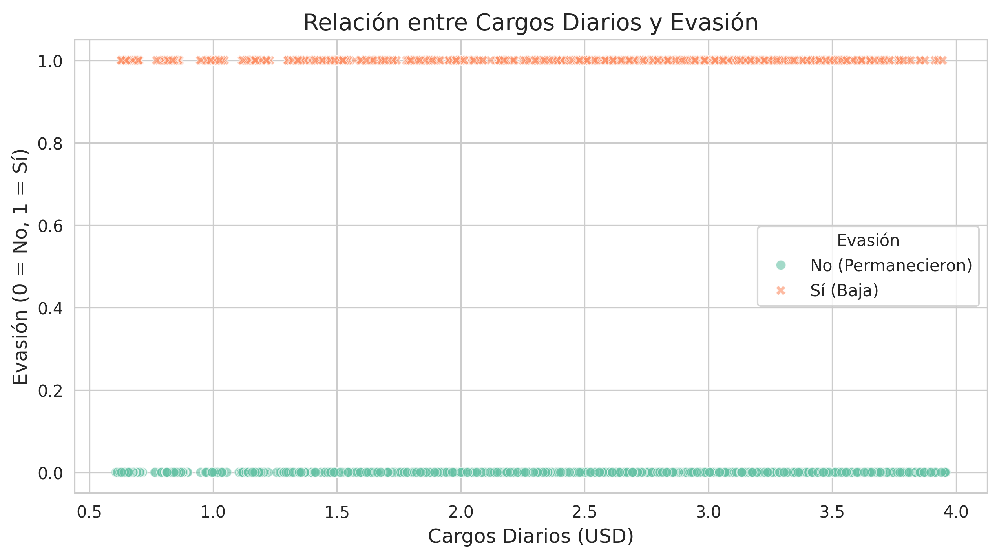
    - **Total de Servicios**:
      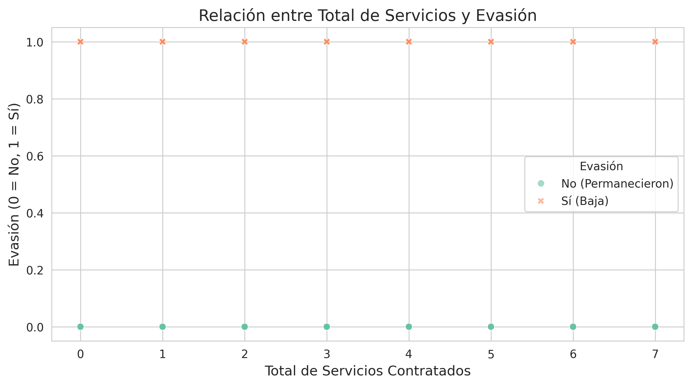

## Dependencias
- Python 3.8+
- pandas
- numpy
- requests
- seaborn
- matplotlib
- plotly
- statsmodels
